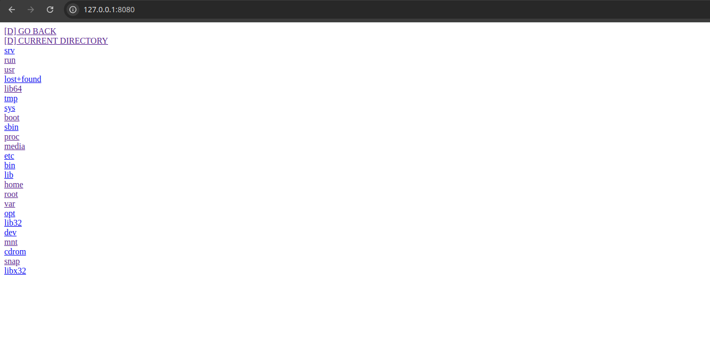

 # C HTTP server
This project is a HTTP server implemented on C language.

It allows you to browse files located on the host machine.

## Installation 
- ssh:
```bash
  git clone git@github.com:SANEKDASH/c-server.git
```
- HTTPS:
```bash
  git clone git@github.com:SANEKDASH/c-server.git
```
Then change current directory to the project directory:
```bash
  cd c-server  
```
After that run build with the following command:  
```bash
  make  
```
Now you can run server on your machine:
```bash
  ./serv
```
## Usage
After you started hosting the server you can connect to it via browser.

Go to the following address in your browser:
```
  http://127.0.0.1:8080
``` 
If there is everything OK with the connection you must be able to see your directory on the browser screen:


## Performance research
As you can see in the code there are several operating modes of the server:
- default:
Only one single connection can be handled at one time.
- multithread:
Several (16) connection can be handled at one time.
- coroutine:
Connections are handled with help of coroutine library written by me.
